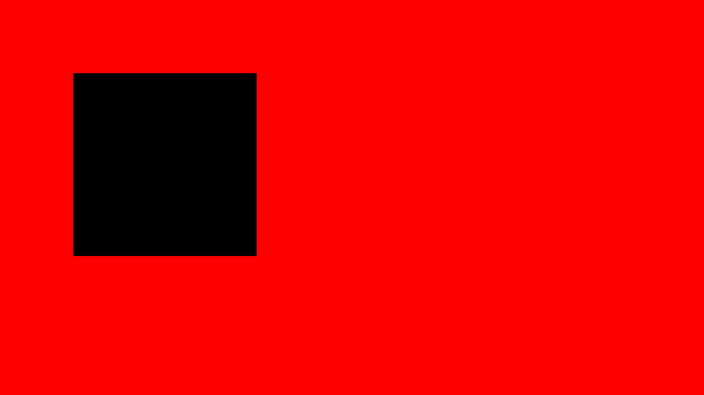

# canvas2D

 Simple rendering library with Canvas API on top of OpenGL.
 Written in C++ with CMake support  

 Supports only desktop

### Dependencies

  - OpenGL
  - GLM
  - SailC++
  - Freetype
 
 These dependencies are included in external directory
  - glad
  - libtess2

### Screenshot ([see example](example/Example.cpp))

 Older screenshots [here](/example/screenshots)
